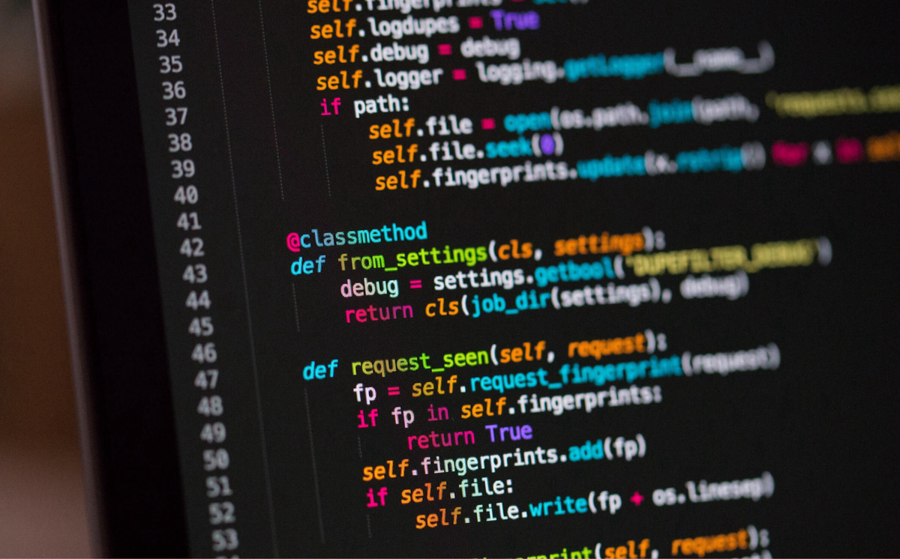

# Jayden Xie

## About Me
Hi, I'm Jayden X. I like to learn new tools.

## As a Programmer
My favorite programming language is **C++**. I also like *Java*.

> I am a quiate person, but I am happy to work within a group. I like to communicate with people and share my ideas. I like learning by building projects and trying new tools.

## Code Sample
```cpp
#include <iostream>
int main() {
    std::cout << "Hello, GitHub Pages!" << std::endl;
    return 0;
}
```

I enjoy programming, listening to music, and learning new technologies.

## Task List
- [x] done
- [ ] not done yet
- [x] done

## Quote
> "Hello World!"

## external link
[Github](https://github.com/HaolinX)

## picture


## Section link
[go to quote](#quote)

## relative link
[go to readme](README.md)

## ordered list
1. 1
2. 2
3. 3

## Unordered list
- 3
- 1
- 2